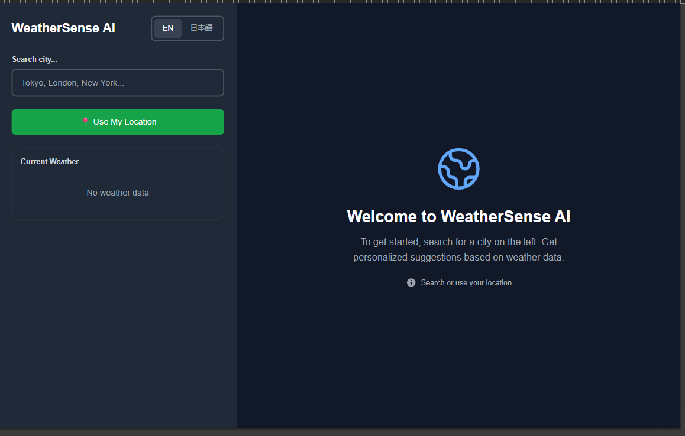
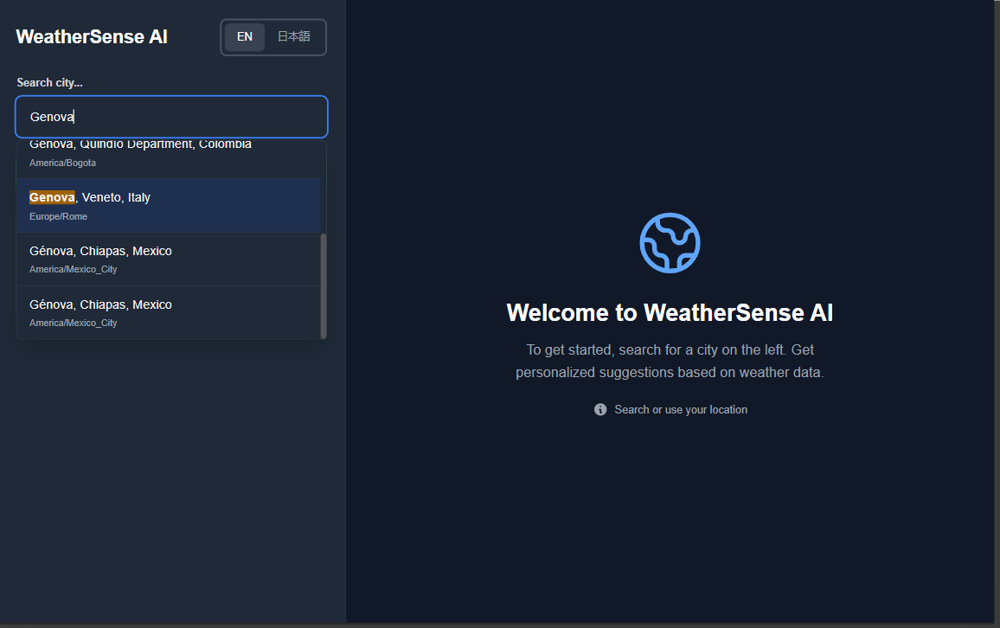
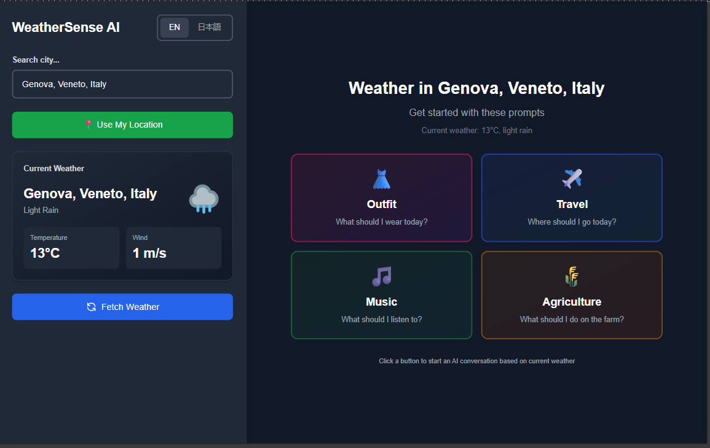
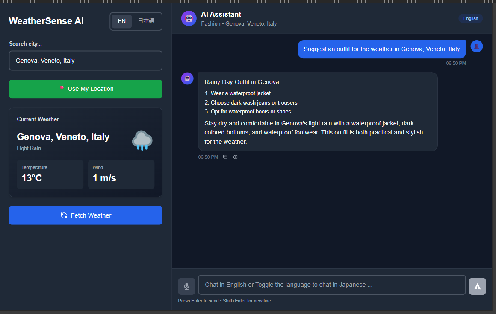
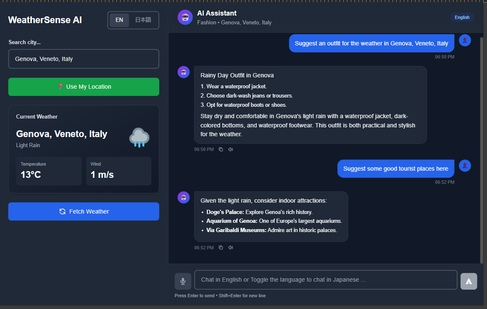
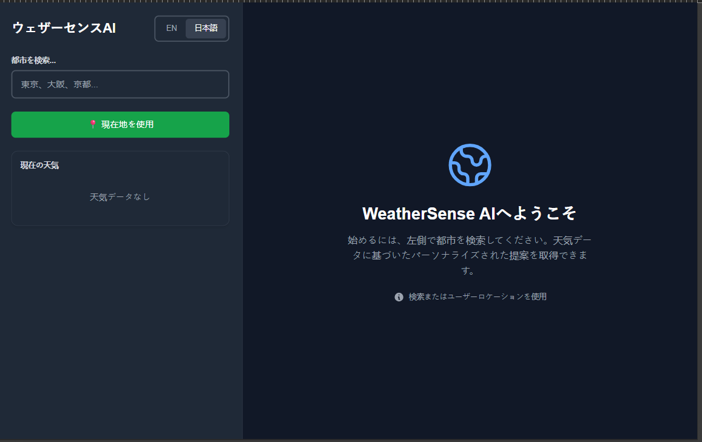
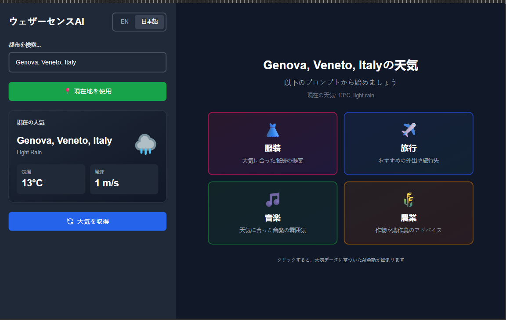
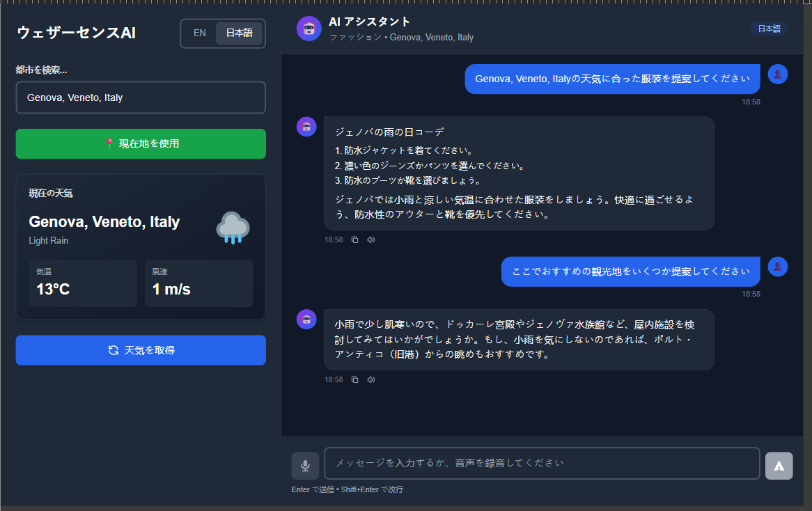

# 🌦️ WeatherSense AI

**Weather-aware AI suggestions & chat assistant (EN/JP) powered by Gemini.**

WeatherSense AI is an intelligent, bilingual weather assistant that provides real-time weather insights and AI-generated recommendations for **Outfit / Travel / Music / Agriculture** — all personalized to your location's weather.

The app includes a full conversational **Chat Mode** where the AI continues the conversation, remembers context, and responds in English or Japanese.

Built with **Next.js, Tailwind, Gemini API**, and fully optimized for fast, interactive usage on web.

---

## 🚀 Features

### 🏙️ **Real-time Weather Search**

* Search any global city
* Auto-fetch using device location
* Clean weather card (temp, wind, condition, icon)

### 🤖 **AI Suggestions (One-click starter prompts)**

After selecting a city, the app shows four quick prompts:

* 👗 Outfit suggestions
* ✈️ Travel / outing ideas
* 🎵 Music recommendations based on weather
* 🌾 Crop & agriculture tips

Internally uses structured AI output with fallback safety.

### 💬 **Full Chat Mode**

* Continue conversation with the AI
* Always weather-aware
* AI understands both **English and Japanese**
* Returns both **EN and JP responses**
* Frontend shows messages according to language toggle
* Voice input capability (optional)

### 🌐 **Bilingual (EN / JP)**

* User can type in EN or JP
* AI auto-detects
* Backend translates JP → EN → JP for consistent logic
* All messages stored in both languages

### 🧠 **Robust Backend Logic**

* Uses Google's Gemini 2.0 Flash (free-tier friendly)
* Clean JSON outputs for structured suggestions
* Chat mode uses history in English for accuracy
* Japanese translations using secondary AI calls
* Markdown-safe rendering
* Bullet points & formatting rendered cleanly with `react-markdown`

---

## 🏗️ Tech Stack

### **Frontend**

* Next.js (App Router)
* React + React Markdown
* Tailwind CSS
* Custom Chat UI (ChatGPT-like)
* Client-side language toggle
* Weather Icons & smooth UI transitions

### **Backend**

* Node.js runtime in Next.js API Routes
* Gemini 2.0 Flash (`generateContent` API)
* Custom translation pipeline (JP ↔ EN)
* Structured suggestions engine
* Chat engine with memory, context, and weather awareness
* Markdown sanitization

### **APIs Used**

* OpenWeatherMap (current weather)
* Gemini API (AI text generation + translation)
* Browser-based geolocation

---

## 📂 Project Structure (Simplified)

```
/app
 ├── api/
 │    ├── weather/route.js       → fetches city weather
 │    ├── generate/route.js      → AI suggestions endpoint
 │    ├── chat/route.js          → conversational AI endpoint
 │
 ├── lib/
 │    └── ai.js                  → Gemini wrapper, translation, sanitization
 │
 ├── (components)/
 │    ├── CitySearch.js
 │    ├── WeatherCard.js
 │    ├── ChatPanel.js
 │    ├── ChatMessage.js
 │    ├── ChatInput.js
 │    ├── StarterPrompts.js
 │    ├── LanguageToggle.js
 │    └── ...other UI components
 │
 └── page.js                     → main layout + app logic
```

---

## ⚙️ Environment Variables

Create `.env.local`:

```
GEMINI_API_KEY=your_key_here
OPENWEATHER_KEY=your_openweather_key
GEMINI_MODEL=gemini-2.0-flash
```

Restart dev server after changes.

---

## 🧪 Running Locally

```bash
npm install
npm run dev
```

Visit 👉 [http://localhost:3000](http://localhost:3000)

---

## 📖 How It Works (High Level)

### 1️⃣ User selects a city

→ Weather fetched & shown on the left.

### 2️⃣ User clicks one of 4 starter prompts

→ Backend `/api/generate` creates structured suggestions (EN + JP).
→ These seed the chat conversation.

### 3️⃣ Chat Mode activates

→ User can ask follow-up questions in EN or JP.
→ Backend normalizes all history into English → produces AI reply → translates to JP → returns both.

### 4️⃣ Frontend displays messages according to language toggle

→ Fully bilingual, seamless switching.

---

## 🛡️ Safety & Stability

* Clean fallback system if AI returns malformed JSON
* Markdown sanitization pipeline (`stripMarkdown` + `react-markdown`)
* Prompts engineered for predictable JSON output

---

## 📸 Screenshots

1. WeatherSense AI — Home (no weather selected).

2. City search

3. Starter prompts after fetching weather (Outfit / Travel / Music / Agri).

4. Seeded chat after clicking a starter prompt (assistant summary + bullets).

5. Multi-turn chat — follow-up question and AI reply.


JP Version Screenshots:

1. 
2. 
3. 


---

## 📹 Demo Video

[WeatherSense AI Demo](https://drive.google.com/file/d/1YL0GlXvWKU4L11Py3OcKxrpwjoYz_oYC/view?usp=drive_link)

---

## 📌 Roadmap (Optional Future Add-ons)

* 7-day forecast support (Open-Meteo)
* Persistent chat history
* Theme switching (Light/Dark)

---
